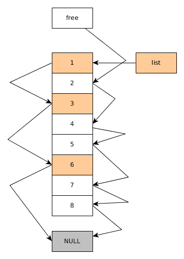

# Pool Data Structure

With the ``free`` list starting at node 2, and the ``list`` variable pointing to 1, this is what the pool array looks like.

Node Id | Next Node
--------|----------
1 | 3
2 | 4
3 | 6
4 | 5
5 | 7
6 | NULL
7 | 8
8 | NULL

